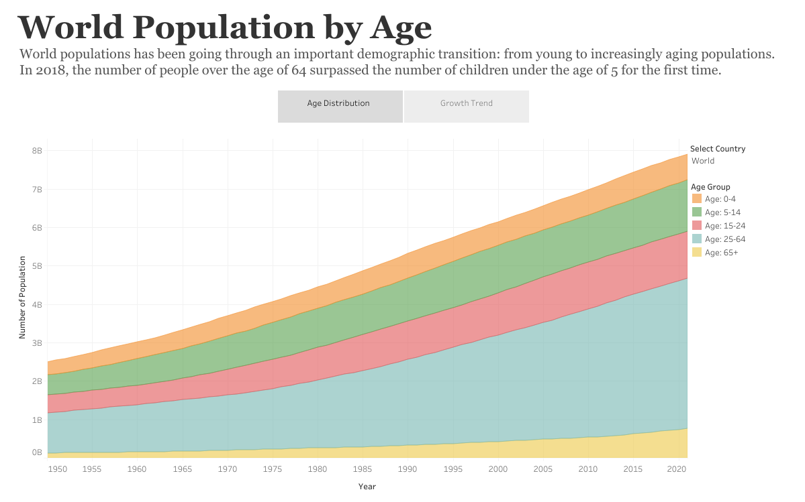

## World Population by Age

World populations has been going through an important demographic transition: from young to increasingly aging populations.
In 2018, the number of people over the age of 64 surpassed the number of children under the age of 5 for the first time.
   
Link to Tableau Public: [World Population by Age](https://public.tableau.com/app/profile/elmoallistair/viz/WorldPopulationbyAge_16702152984220/Story_1)

Data Source: https://ourworldindata.org/

### Preview

